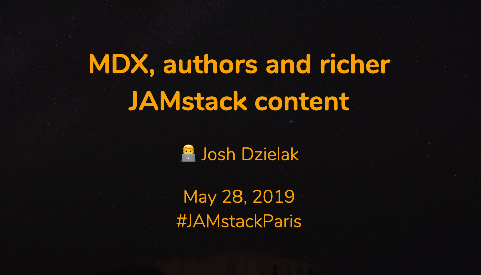

# MDX, authors and richer JAMstack content

A talk given at JAMStack Paris on May 28, 2019. View the [slides here](https://mdx-talk.developermode.com/).

Built with [mdx-deck](https://github.com/jxnblk/mdx-deck).

## Thanks to

- [Brent Jackson](https://github.com/jxnblk) for creating [mdx-deck](https://github.com/jxnblk/mdx-deck)
- [John Otander](https://github.com/johno) for creating [MDX](https://github.com/mdx-js/mdx)
- [Netlify](https://netlify.com/) for hosting the slides
- [JAMstack Paris](https://jamstack.paris/) for inviting me to speak
